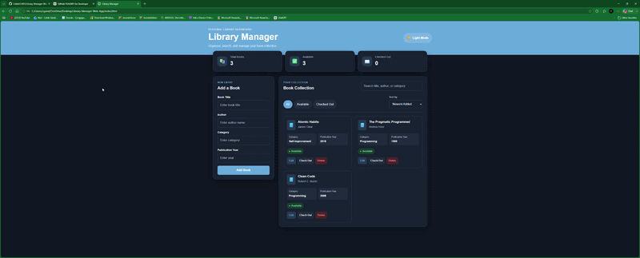

# 📚 Library Manager Web App

A responsive Library Manager built with HTML, CSS, and JavaScript.

---

## 🌐 Live Demo

**Try it here:**

https://calebg1301.github.io/Library-Manager-Web-App/

---

## ✨ Features

- 📚 Add books
- ✏️ Edit books
- 🗑 Delete books
- 🔄 Check Out / Return books
- 🔍 Live search
- 📂 Filter books
- ↕ Sort books
- 🌙 Dark / Light mode
- 💾 Local Storage
- 📱 Responsive design

---

## 🛠 Technologies

- HTML5
- CSS3
- JavaScript (ES6)
- Local Storage API
- GitHub Pages

---

## Screenshots

(Add screenshots here later.)

---

## Future Improvements

- User authentication
- MySQL database
- Spring Boot backend
- REST API
- Book cover images
- Multiple user accounts

---

## Author

**Caleb Gandee**

Application Developer
